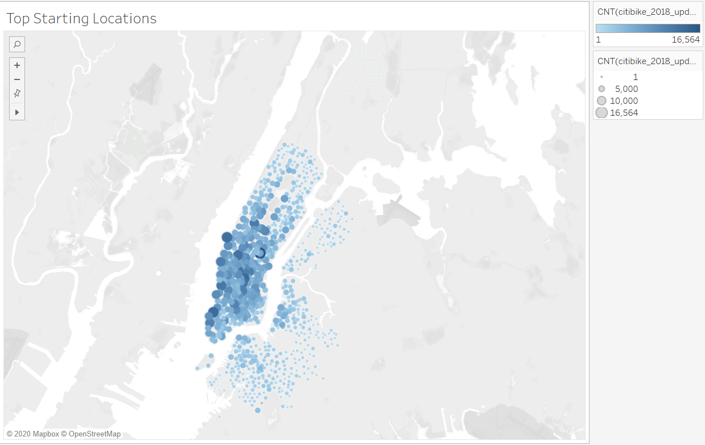
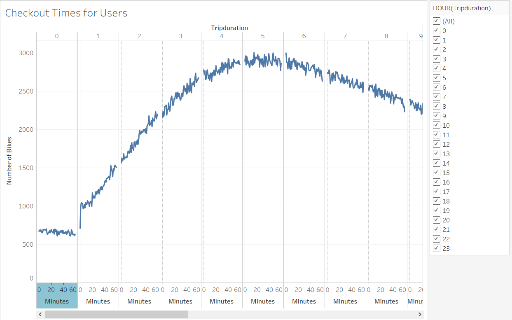
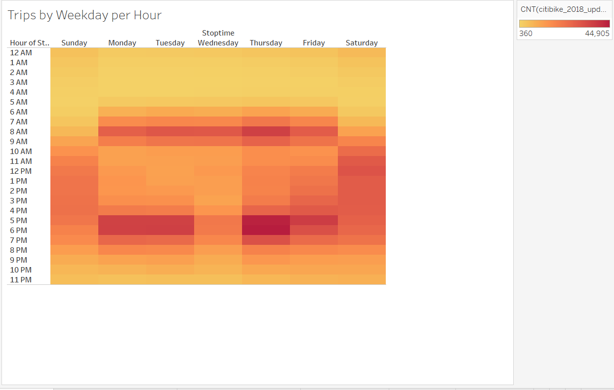
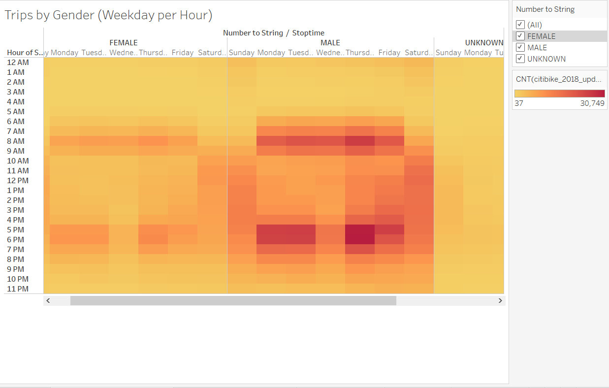
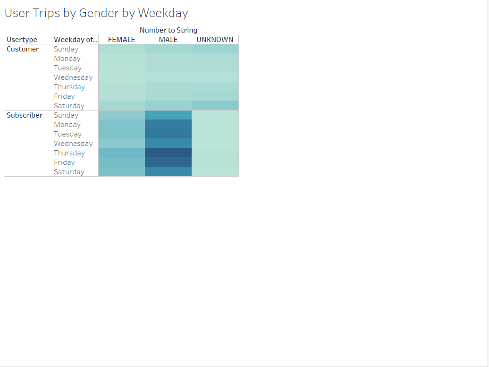
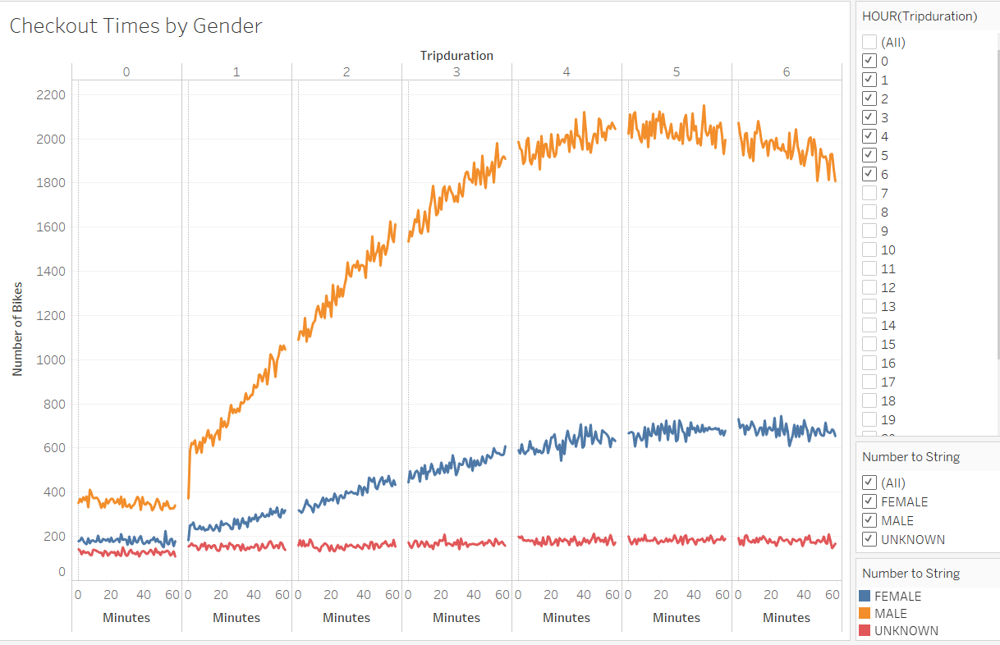

# Bikesharing Analysis 

[link to dashboard]https://public.tableau.com/profile/syed.abrar.hossain#!/vizhome/Bike-sharingAnalysis/NYCitiBikeStory
## Overview of Statistical Analysis

The Analysis was performed to convince investors to invest on a bike-sharing program in Des Moines, Iowa. To convince the investors that bikesharing would be a solid business, analysis was performed on a dataset of New York city CitiBike bike-sharing data for August 2018. From the measures and dimensions available in the dataset various visualizations were created in order to show the potential of a similar program in Des Moines. The various visualizations that will be shown to answer the following questions:
- Total Number of Rides in August of 2018 taken by riders in New York 
- Top starting locations for rides in New York City for August 2018
- Checkout times by user 
- Trips by Weekday per Hour 
- Trips by Gender (Weekday per hour) 
- User trips by Gender by Weekday 
- Checkout Times by Gender 

This report also summarizes a high-level summary of the results and includes two other visualizaations that can be also performed in the dataset to convince them to invest in this business idea. 

## Results 

### Total Number of Rides in August of 2018 by riders in New York 

From this visualization we can see that there are a total number of 2,344,234 rides in New York city that were taken just in the month of August, 2018 during the peak time of the year. This number shows the great popularity of bikesharing in a city like New York and it would have high potential too in Des Moines

### Top starting locations for rides

From this symbol map it can be seen there are clusters in certain areas of New York city where most rides were taken. The darker the area in the city the more rides were taken there. From there it can be seen that certain places have a lot of rides taken, specifically the midtown area in Manhattan which is big tourist destination. Therefore, similarly more bike stations in tourist areas would make it profitable in Des Moines too. 

### Checkout times by User 

This visualization is showing how long the riders typically rent the bikes out for. From the graph it can be seen that there is a peak at 5 hours, so most riders are renting these bikes for 5 hours, which shows that bike rentals are taken out for a long amount of time and many bikes are needed to be profitable in the business. 

### Trips by Weekday per Hour 

This visualization is showing the day and times of the week there are riders. The darker color in the chart represents more riders for that specific time for the time of the week. It can be seen that rush hours during the week and weekends in general see a lot of ridership. 

### Trips by Gender (Weekday per Hour) 

This visualization is showing the day and times of the week there is riders for each of the respective genders. THe darker color in the chart represents more riders for that speicific gender type for that particular time and day of the week. From the chart it can be seen that Men typically are the gender type who enagage in bikesharing and more so during weekdays in the rush hours. 

### User trips by Gender by Weekday 

This chart is showing the ridership during the times of the week with respect to the gender and type of user. Again we can see that Male users who are subscribed have more ridership during the week. 

### Checkout times by Gender 

From this image is showing how long the riders typically take the bike out for with respect to their gender. We can again see that Men usually take them out for the longest usually around 5 hours during a rental. 

## Summary 

From our visualizations and analysis we can observe key metrics and potential of the bikesharing business. Our analysis has shown that there were over 2 million riders alone in the month of August which is the peak season. There also seems to be a lot of rides from a few specific areas, mostly from tourist spots in the city. Riders typically rent the bike out for more than 5 hours during a rental and Men usually rent them out for the longest. Furthermore, we were also able to deduce that rush hours during the week and weekends are busy times and have a lot of ridership. Furthermore, subscribers to the bikesharing programs usually take a lot more rides and Men in general are the gender type that take most of the rides. 

We have uncovered a lot of key facts, however these two additional visualizations can be performed in the future analysis: 
- Trip duration with respect to the user type (Subscriber and Customer) 
- Number of rides taken by a user with respect to their age (birth year) and gender type 

This analysis has answered key questions to convince the investors that bikesharing program can be very successful in Des Moines. The key metrics and observations from these visualizations can target to the right audience and aid in setting up and running this business successfully. 
